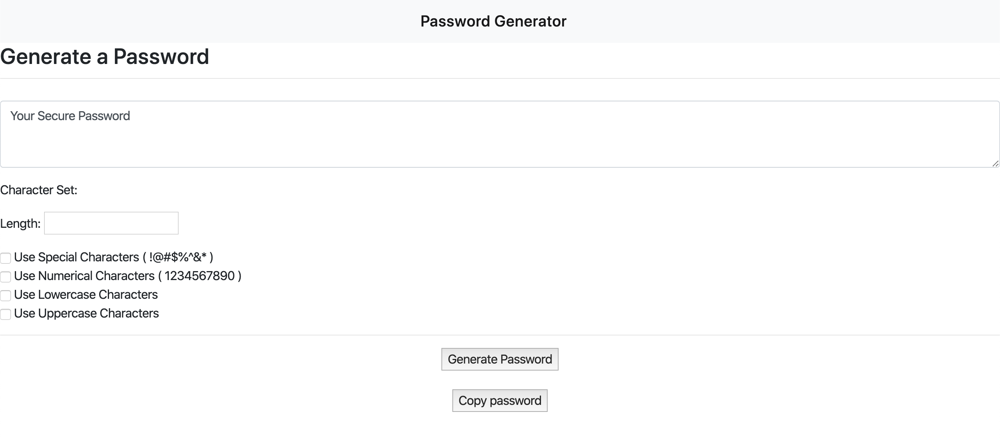

# password-generator
Password Generator

## Deployed Link

https://samanthasengsouvanh.github.io/password-generator/

## User Story

My motivation to create this project was the importance of my own data security. I wanted to provide a way for users to create secure passwords to prevent the vulnerability of a security breach. By using the password generator, it resolves the issue of creating "easy" to decipher passwords. In creating this project, I learned the more intricate password you have, the more secure your data will be.

## Business Context

The application should validate user input and ensure that at least one character type is selected.
Once all prompts are answered, the user will be presented with a password matching the answered prompts.

## Screenshots

## Authors

Samantha Sengsouvanh - Initial work 

## License

This project is licensed under the MIT License - see the LICENSE.md file for details
